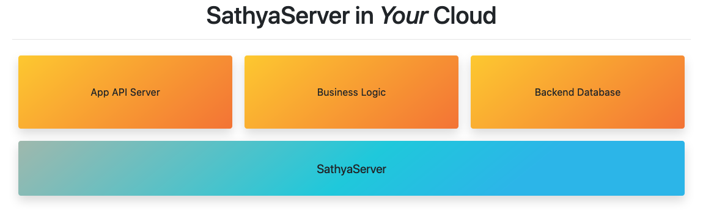

# SathyaServer
SathyaServer is a server framework. It is comprised of modules, such as a web server, file server, group policy, etc.

**SathyaServer is still under development. Expect breaking changes!** 
> Once SathyaServer has reached a "initial feature-complete" stage, backwards compatibility between versions will be a priority.

## Running (Linux/macOS)

See the instructions: https://dolphinbox.github.io/sathya/

## Developing Modules
See "Developing_Modules.md" in the docs folder.
