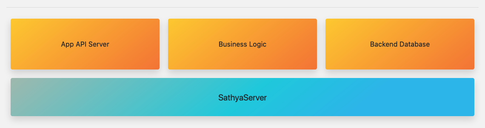

# Welcome to SathyaServer!

Sathya is a framework for building servers. It's versatile, and builds the base of a full server stack.



Sathya is comprised of *Modules*. Modules are what give Sathya it's functionality. Each SathyaServer is unique, with 
it's own combination of Modules.

Sathya Modules let you build *your* cloud. Modules could be...
* a Web Server
* a File Server
* a custom REST API for an App
* a GUI Touch Interface
* ...anything you want!

Sathya Modules can be written in JavaScript/Node or Java (Thanks to Sathya's Runtime: GraalVM). 

Modules can be written in the language of your choice, and interoperate with the rest of Sathya. **Python, Ruby, R, JVM-based languages like Java, Scala, Groovy, Kotlin, Clojure, and even LLVM-based languages such as C and C++**. It's your choice. 

**Sathya is the perfect platform to build a backend server, IoT Device, Kiosk, etc**.

> SathyaServer is still under development, but the core features are complete and ready to try out.

## Getting Started
Until an official, supported, version of SathyaServer is released, you can try it from source.
> Make sure you have NodeJS/NPM installed. This is only a requirement to run the installDepends script. SathyaServer itself will use the bundled Graal runtime.

Clone the git repository and move into the folder:
```bash
git clone https://github.com/DolphinBox/sathya.git
cd sathya
```

After cloning the repo install all the dependencies:
```bash
./installDepends.sh
```
This will download GraalVM, install all the node modules, build files, etc.

Then, to start SathyaServer on Linux:
```bash
./bootstrap-linux
```
and on macOS:
```bash
./bootstrap-darwin
```

By default, the WebUI module will listen on port 3030 (http://localhost:3030).

The Modules folder is where Sathya will load modules from (this can be configured in `config.ini`).

### For Developers
* [Developing Modules](Developing_Modules)
* [Legal FAQ](Legal_FAQ)
### For IT
* [Deployment Guide](Deployment_Guide)

# Sathya Fluid
Sathya Fluid is a cross-platform management, deployment, configuration and synchronization system, similar to Microsoft's 
Active Directory services, built on Sathya.
> Fluid is still under planning and development, and is not ready for use. Stay tuned!